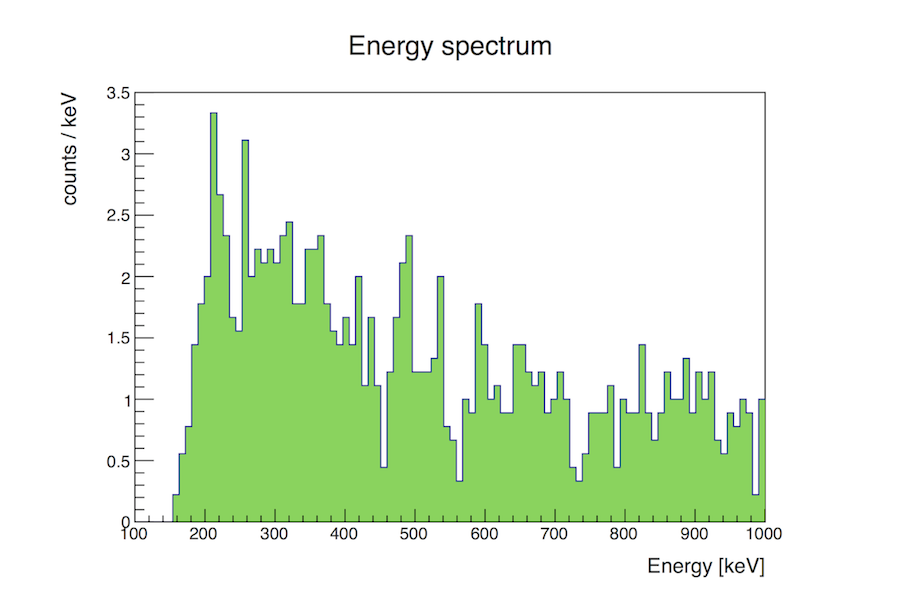
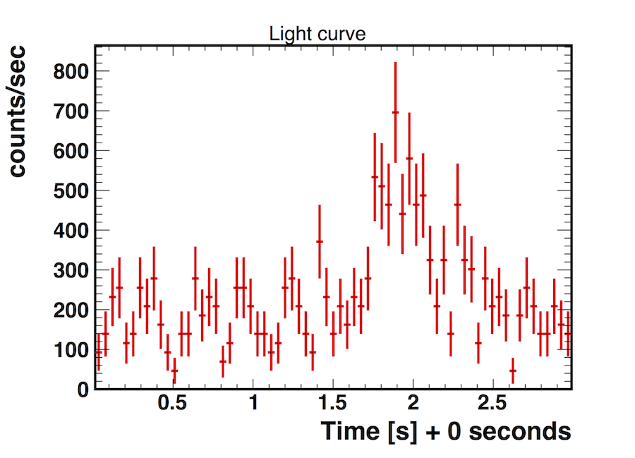

# GRB170817A Simulations <br />
The goal is to simulate the GRB source GRB170817A together with the background. The main objective 
is to obtain the light curve of the source. We will first simulate the events using Cosima, then we will simulate
the event reconstruction using Revan, and finally we will analyze the simulated data using Mimrec.<br />

We use: 
- MEGAlib version: 3.00.00
- Root version: 6.18.04
- Geant4 version: 10.02.p03

## First simulate the events using Cosima: <br />

  - Use the source file **GRB170817A.source**. This is the source file for GRBs, with spectrum and light curve 
  determined from the files **GRB170817A_main_peak_mid.dat** and **GRB170817A_LC.dat**, respectively. We are using the 
  geometry file **AMEGO_Midex/AmegoBase.geo.setup**.
  
  - The execuatable (with the specified seed 432020) is:  <br />
  ```
  cosima -s 432020 GRB170817A.source | tee terminal_output_cosima.txt
  ```
  Note: the part "| tee terminal_output_cosima.txt" just saves the terminal output to a text file for future reference. And the 
  specification of a seed allows different users to directly compare results. Runs with the same seed should generate identical
  output (is there any statistical variation expected here??).
  
  - The main terminal output from the end of the run is below: <br />
```
Summary for run SpaceSim

Total number of generated particles:     148796
  Source GRB:                            148796

Total CPU time spent in run:             8.38628 sec
Time spent per event:                    5.63609e-05 sec

Observation time:                        3 sec

Graphics systems deleted.
Visualization Manager deleting...
```
- The main output file containing the simulated events is **GRB170817A.inc1.id1.sim**. <br />

## Next simulate the event reconstruction using Revan: <br />

- First simulate just the source. The executable is below:
```
revan -g AMEGO_Midex/AmegoBase.geo.setup -c revan_AMEGOX_R1_below10MeV.cfg -f GRB170817A.inc1.id1.sim | tee terminal_output_revan.txt
```
Note: we are using the simulated events from the last step: **GRB170817A.inc1.id1.sim**. 
And for the reconstruction we use the configuration file: **revan_AMEGOX_R1_below10MeV.cfg**. <br />

- When the GUI comes up do: Reconstruction -> Start event reconstruction

- The main terminal output at the end of the run is below:
```
----------------------------------------------------------------------------


Trigger statistics:
  Not triggered events: ..................................   2796
  Number of vetoed events: ...............................     11
    Raised vetoes (multiples possible)
      MainVetoSide: ......................................      5
      MainVetoTop: .......................................      6
    Raised triggers canceled by a veto (multiples possible)
  Number of triggered events: ............................    264
    Raised triggers (multiples possible)
      MainTriggerCsI: ....................................     10
      SiOnly: ............................................    136
      SingleSiCsI: .......................................    138


----------------------------------------------------------------------------

Event statistics for all triggered (!) events:
  Number of events .......................................    264 (100.000%)
  Number of events, which passed event selections ........    167 ( 63.258%)
  Reconstructable events .................................    264 (100.000%)
       Single-site  ......................................      0 (  0.000%)
       Compton  ..........................................    167 ( 63.258%)
           Decay  ........................................      0 (  0.000%)
       Pair  .............................................      0 (  0.000%)
       Muon  .............................................      0 (  0.000%)
       PET . .............................................      0 (  0.000%)
       Multi  ............................................      0 (  0.000%)

Rejection reasons for not reconstructable events:
  Event consists of nothing but one track ................     47
  Event consists of nothing but two tracks ...............      2
  Track is not valid .....................................      4
  Event starts not in D1 .................................     11
  Electron direction is not valid ........................      2
  Comptel type with incompatible kinematics ..............     31
    Total ................................................     97

----------------------------------------------------------------------------


Event reconstruction finished in 2.28322 sec.
```

- The output file is **GRB170817A.inc1.id1.tra**.  <br />

- We want to analze the source plus the background, so we combine the source results with a simulated background (that has already 
been calculated). We use a 3 second extraction from the 
background sims: **TotalBackground_R1/TotalBackground_R1_minusTrappedLeptonic.extracted_3s.tra**. <br />

- The combination file is: **GRB170817A_w_Background.tra**. See this file for how the combination is made. 
This is the file that we analyze in the final step below. 

## Lastly analyze the simulated data with Mimrec: <br />

- We start with running the executable:
```
mimrec -g AMEGO_X/Geometry/AMEGO_Midex/AmegoBase.geo.setup -f GRB170817A_w_Background.tra | tee terminal_output_mimrec.txt
```
- When the GUI comes up run: Selections -> Show event selections.

- Here is the main terminal output: 

```
Event selections:

All events  .................... 1718
Not rejected events  ........... 1118

Rejection reasons:

Not good  ......................  97
Event Id .......................  0
Start detector .................  0
Beam  ..........................  0
Total energy  ..................  504
Time  ..........................  0
Time walk  .....................  0
Electron energy  ...............  0
Gamma energy  ..................  0
Compton angle  .................  0
First Lever arm  ...............  0
Any lever arm  .................  0
Length Compton sequence ........  0
Clustering quality factor ......  0
Compton quality factor .........  0
Track quality factor ...........  0
Coincidence window .............  0
Earth-Horizon cut ..............  0
Pointing .......................  0
Max. theta deviation ...........  0
Max. ARM .......................  0
Max. SPD .......................  0
Length track ...................  0
Opening angle pair  ............  0
Initial energy deposit pair  ...  0
Pair quality factor ............  0
Use photos  ....................  0
Use pairs  .....................  0
Use Compton  ...................  0
Use tracked Compton  ...........  0
Use not tracked Compton  .......  0
Use muons  .....................  0
Use PET  .......................  0
Use multi  .....................  0
Use unidentifiables  ...........  97
Use decays  ....................  0
Use flagged as bad  ............  97

ACCEPTED  ......................  1118
ANALYZED  ......................  1718

```

- We can plot the energy spectra by selecting: Analysis/Response -> Energy spectra. We'll use 100 bins, an acceptance radius of 15 degrees, and no other cuts. This plot and corresponding output is shown below. 



```
Energy spectrum - some additional statistics:
Number of events:     1118 (inside=1118, outside=0)
Avg. measured energy: 506.082 keV
```

- We then select events between 200 - 600 keV, corresponding to the peak emission. This is done in Selections -> Event selections -> Energy. We can then obtain the light curve at Analysis/Response -> Light curve. The plot is shown below.


