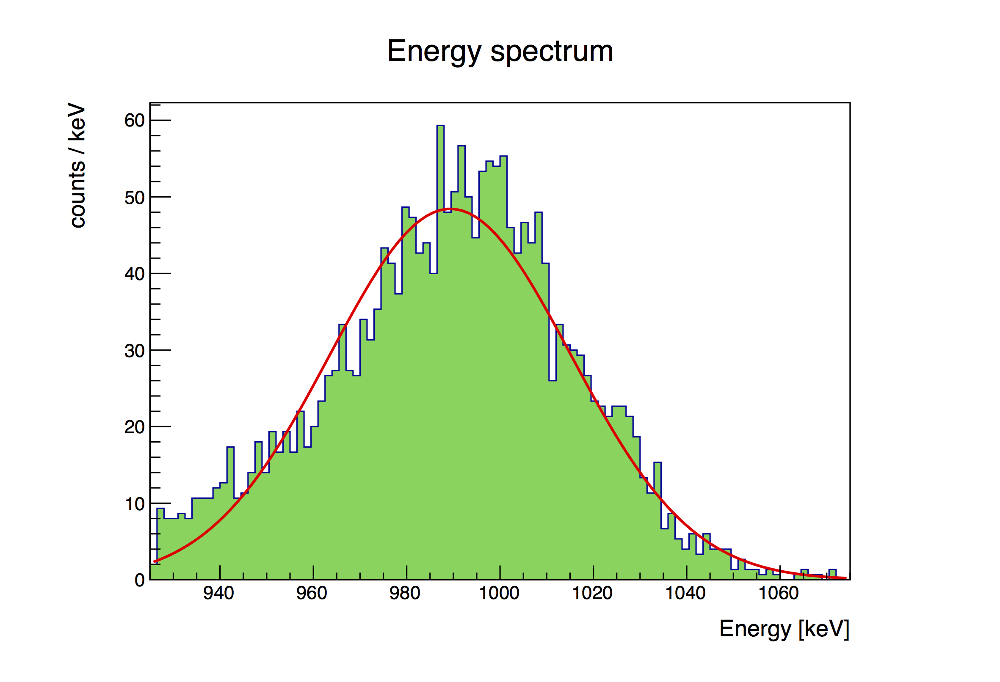
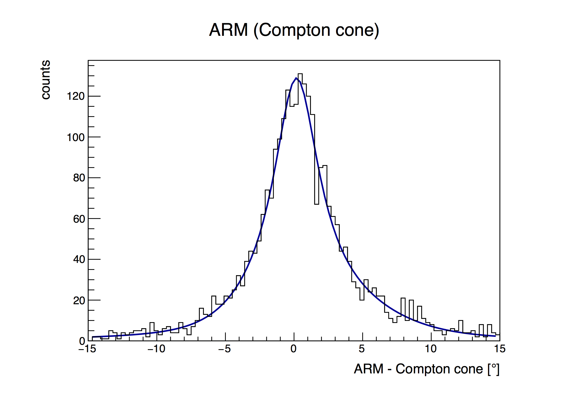

# Simulation Challenge <br />
The Simulation Challenge will introduce you to MEGAlib and help you work through a manual calculation of the energy resolution, angular resolution, and effective area of AMEGO-X at 1 MeV. We will first simulate the events using Cosima, then we will simulate
the event reconstruction using Revan, and finally we will analyze the simulated data using Mimrec.<br />

We use: 
- MEGAlib version: 3.00.00
- Root version: 6.18.04
- Geant4 version: 10.02.p03
- Geometry file: AMEGO_Midex/AmegoBase.geo.setup (available in the GRB170817A repository)

More information on MEGAlib can be found [here](http://megalibtoolkit.com/home.html).

## First simulate the events using Cosima: <br />
 
  - Use the source file **FarFieldPointSource_1MeV.source**. This is a far field point source starting at (0,0) in sphereical coordinates, with a monoenergetic beam at 1000 keV (particle type 1). It uses the Livermore physics lists which are recommended for lower energy EM processes (Standard is better for high energy events). It requires 20k triggereed events before stopping (there are various ways to stop the process, such as number of events or time).

  - The execuatable (with the specified seed 432020) is:  <br />
  ```
  cosima -s 432020 FarFieldPointSource_1MeV.source | tee terminal_output_cosima.txt
  ```
  Note: the part "| tee terminal_output_cosima.txt" just saves the terminal output to a text file for future reference. And the 
  specification of a seed allows different users to directly compare results. Analysis runs with the same seed should generate identical
  output (within statistical uncertainty).
  
  - The main terminal output from the end of the run is below: <br />
```
Summary for run FFPS

Total number of generated particles:     976447
  Source Pos:                            976447

Total CPU time spent in run:             80.9221 sec
Time spent per event:                    8.28741e-05 sec

Observation time:                        0.0138314 sec

Graphics systems deleted.
Visualization Manager deleting...
```
- The main output file containing the simulated events is **FarFieldPointSource_1MeV.inc1.id1.sim**. <br />

## Next simulate the event reconstruction using Revan: <br />

- The executable is below:
```
revan -g AMEGO_Midex/AmegoBase.geo.setup -c revan_AMEGO_X.cfg -f FarFieldPointSource_1MeV.inc1.id1.sim | tee terminal_output_revan.txt
```
Note: we are using the simulated events from the last step: **FarFieldPointSource_1MeV.inc1.id1.sim**. 
And for the reconstruction we use the configuration file: **revan_AMEGO_X.cfg**. <br />

- When the GUI comes up run: Reconstruction -> Start event reconstruction

- The main terminal output at the end of the run is below:
```
----------------------------------------------------------------------------


Trigger statistics:
  Not triggered events: ..................................   5031
  Number of vetoed events: ...............................   1229
    Raised vetoes (multiples possible)
      MainVetoSide: ......................................    502
      MainVetoTop: .......................................    754
    Raised triggers canceled by a veto (multiples possible)
      MainTriggerCsI: ....................................     48
      SiOnly: ............................................    390
      SingleSiCsI: .......................................    247
  Number of triggered events: ............................  13740
    Raised triggers (multiples possible)
      MainTriggerCsI: ....................................   1561
      SiOnly: ............................................   8959
      SingleSiCsI: .......................................   6342


----------------------------------------------------------------------------

Event statistics for all triggered (!) events:
  Number of events .......................................  13740 (100.000%)
  Number of events, which passed event selections ........   8027 ( 58.421%)
  Reconstructable events .................................  13740 (100.000%)
       Single-site  ......................................      0 (  0.000%)
       Compton  ..........................................   8010 ( 58.297%)
           Decay  ........................................      0 (  0.000%)
       Pair  .............................................      0 (  0.000%)
       Muon  .............................................     17 (  0.124%)
       PET . .............................................      0 (  0.000%)
       Multi  ............................................      0 (  0.000%)

Rejection reasons for not reconstructable events:
  Too many hits in CSR ...................................      2
  Event consists of nothing but one track ................   5088
  Event consists of nothing but two tracks ...............     41
  Track is not valid .....................................     22
  Event starts not in D1 .................................    475
  Electron direction is not valid ........................     57
  Comptel type with incompatible kinematics ..............     28
    Total ................................................   5713

----------------------------------------------------------------------------


Event reconstruction finished in 17.9897 sec.
```

- The output file is **FarFieldPointSource_1MeV.inc1.id1.tra**.  <br />

## Lastly analyze the simulated data with Mimrec: <br />

- We start with running the executable:
```
mimrec -g AMEGO_X/Geometry/AMEGO_Midex/AmegoBase.geo.setup -c mimrec_1MeV_AMEGO_X.cfg -f FarFieldPointSource_1MeV.inc1.id1.tra | tee terminal_output_mimrec.txt
```
- Mimrec is where the event selection happens, and these event selections are included in the configuration file.

- When the GUI comes up run: Selections -> Show event selections.

- Here is the main terminal output: 

```
Event selections:

All events  .................... 13740
Not rejected events  ........... 3236

Rejection reasons:

Not good  ......................  5734
Event Id .......................  0
Start detector .................  0
Beam  ..........................  0
Total energy  ..................  10428
Time  ..........................  0
Time walk  .....................  0
Electron energy  ...............  0
Gamma energy  ..................  0
Compton angle  .................  0
First Lever arm  ...............  3
Any lever arm  .................  2
Length Compton sequence ........  0
Clustering quality factor ......  0
Compton quality factor .........  0
Track quality factor ...........  0
Coincidence window .............  0
Earth-Horizon cut ..............  0
Pointing .......................  0
Max. theta deviation ...........  0
Max. ARM .......................  0
Max. SPD .......................  0
Length track ...................  0
Opening angle pair  ............  0
Initial energy deposit pair  ...  0
Pair quality factor ............  0
Use photos  ....................  0
Use pairs  .....................  0
Use Compton  ...................  0
Use tracked Compton  ...........  0
Use not tracked Compton  .......  0
Use muons  .....................  17
Use PET  .......................  0
Use multi  .....................  0
Use unidentifiables  ...........  5713
Use decays  ....................  0
Use flagged as bad  ............  5713

ACCEPTED  ......................  3236
ANALYZED  ......................  13740

```

The above output shows that there are 13740 events that have made it through the revan reconstruction into the .tra file. Only 3236 of these events have made it through our imposed event selections, and you can see that most of them have been rejected due to the Total energy. This is because we have placed a tight constraint on the allowed energy just around the 1 MeV photopeak, as discussed further below.

To look at the image hit the play button. It should look like a perfect point source at (0,0).

To look at the energy spectrum run: Analysis/Response -> Energy Spectra

Here I made no additional selection, and chose 100 bins



```
Energy spectrum - some additional statistics:
Number of events:     3236 (inside=3236, outside=0)
Avg. measured energy: 989.298 keV
```

From here choose Tools -> Fit Panel

Fitting the peak with a simple Gaussian gives:

```
TFitEditor::DoFit - using function PrevFitTMP  0x3478660
 FCN=84.9269 FROM MIGRAD    STATUS=CONVERGED      62 CALLS          63 TOTAL
                     EDM=3.14769e-07    STRATEGY= 1      ERROR MATRIX ACCURATE 
  EXT PARAMETER                                   STEP         FIRST   
  NO.   NAME      VALUE            ERROR          SIZE      DERIVATIVE 
   1  Constant     4.84390e+01   1.37901e+00   4.81516e-03   2.43271e-04
   2  Mean         9.89349e+02   6.36081e-01   2.64350e-03  -3.40107e-04
   3  Sigma        2.58122e+01   5.00658e-01   2.12800e-05  -9.21690e-02
 ```
 
This means the energy resolution is 25.8 keV (the width of the gaussian fit). Since this is at 1 MeV, there are no pair events here. In the configuration file, we have allowed both tracked and untracked events, so this is a combination of the two.

The config file has already selected an energy window of +/- 3sigma around the peak. When calculating the effecitve area for monoenergetic sources, we always select on the photopeak to only count the events which have been properly reconstructed. +/- 3sigma is standard, but tighter constraints will give a better angular resolution.

Now we do the ARM analysis since we are in the Compton regime.

run: Analysis/Response -> ARM of scattered gamma ray

theta/phi = 0 and the acceptance radius is 15 deg with 100 bins in the histogram

Here are the results:



```
Statistics of ARM histogram and fit
***********************************

Analyzed Compton and pair events:        3236
Compton and pair events in histogram:    2850 (88.0717%)

RMS:                                     4.34008 deg

Total FWHM of fit (not of data!):        4.48191 deg
Maximum of fit (x position):             0.183115 deg (1-sigma uncertainty: 0.107885 deg ... 0.256923 deg) with maximum 128.897 cts
```

Here, the FWHM of the ARM distribution represents the angular resolution of the instrument in the Compton regime.

Now we have effectively measured the energy resolution at 1 MeV (25.8 keV) and the angular resolution (4.48 deg). We can now take these data to calculate the effective area. In addition to a photopeak energy cut, we also make a selection on the ARM, where we only count the events which are reconstructed to be within 1 FWHM of the true source position. I'll go back to the menu: Analysis/Response -> ARM of scattered gamma ray

And select 4.48 deg for the Acceptance Radius. Here are the results:

```
Statistics of ARM histogram and fit
***********************************

Analyzed Compton and pair events:        3236
Compton and pair events in histogram:    2188 (67.6143%)
```

To calculate the Aeff:
```
A_eff = [# detected events] / [# of generated events] * [area of surrounding sphere]
```

events in histogram = 2188 
generated events = 976447 (this is the last line of the .sim file. TS 952758)
Area of surrounding sphere = 70685.8 (from the geometry file)

I get A_eff = 2188 / 976447 * 70685.8 = 158.4 cm^2 for the effective area of AMEGO-X at 1 MeV.

