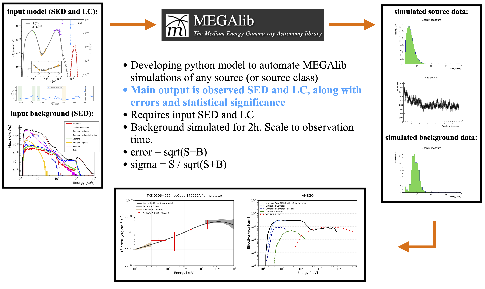
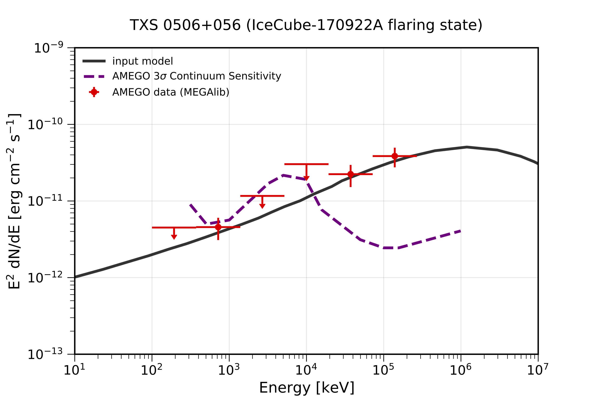

# MEGAlib Python Module

## Required Software  
The python module is meant to be used with the MEGAlib code, available [here](http://megalibtoolkit.com/home.html). Among other things, MEGAlib simulates the emission from any (MeV) gamma-ray source, simulates the instrument response, and generates the simulated data for a given detector design, exposure time, background emission, etc. See the above link for more details regarding the MEGAlib package. Examples for running MEGAlib can be found in this repository in the folders "Simulation_Challenge" and "GRB170817A".  

## Purpose  
The primary code in this folder is **Run_MEGAlib_module.py** and **Process_MEGAlib_module.py**, which is called with **client_code.py**. The Run_MEGAlib_module is essentially a python wrapper for running MEGAlib. The Process_MEGAlib_module processes the main MEGAlib input/output. The modules can be ran directly from the command line, or submitted to a batch system, which allows them to be employed for easilt generating multiple simulations. Here, the code is applied to the specific case of TXS 0506+056. 

## Background Model  
The AMEGO backgrounds can be found [here](https://github.com/ComPair/Simulation-Data-Files/tree/master/AMEGO_Probe). There are two options, R1 and R5, each organzied with respect to the different components. Currently, R5 is being employed as default. 

## Getting Help and Additional Development  
For any help/problems with running the code please contact me at: ckarwin@clemson.edu. The main modules can easily be further developed for any MEGAlib tasks. I am happy to help with this if there are any specific requests!

## Basic Overview  
The code can be used for either AMEGO or AMEGO-X. Note that here we are using AMEGO. The difference mainly amonts to the geometery file and the perfomance plots. 

**Important Note: The code has been cross-checked with the canonical telescope performance, and it produces results that are consistent with the sensitivity.** 

Below is a schematic showing an overview of the general process:

## Quick Start Guide:   
<pre>
<b> 1. Make the main working directory </b> 
  - Needs to contain the following
    -- client_code.py
    -- Run_MEGAlib_module.py (this can also just be in the the python path instead of the main directory)
    -- Process_MEGAlib_module.py (this can also just be in the the python path instead of the main directory)
    -- ExtractSpectrum.cxx
    -- ExtractLightCurve.cxx
    -- submit_jobs.py (for submitting to batch system)
    -- inputs.yaml
    -- AMEGO_Performance directory (for overlaying to plots; can be commented out in Process_MEGAlib_module.py if not wanted)

<b> 2. Specify inputs in inputs.yaml </b>
  - The input files need to be in the main working directory, or a subdirectory therein.
  - Note: if input files are in a subdirectory then be sure to specify the relative path (from main directory).
  - The input files need to have the proper forms, as specified in the MEGAlib documentation. See TXS_0506_056 files for example template.

<b> 3. To run the code: python client_code.py </b>
  - Uncomment the functions inside the client code that you want to run.
  - The yaml file can be passed from the terminal if needed, otherwise it uses the defualt specified in the client code.
  - The code can be ran directly from the terminal or submitted to a batch system using submit_jobs.py (for example).

<b> 4. The client code calls Run_MEGAlib_module.py and Process_MEGAlib_module.py </b>
  - Run the help commands in the client code for a description of the function inputs for each module.
  - The module files shouldn't require too much modification.

Below are the executables for running directly from terminal (mainly for testing, saving configuration files, etc):

1. cosima -s seed name.source | tee terminal_output_cosima.txt
2. revan -g geometry_file -c configuration_file -f name.inc1.id1.sim 
3. mimrec -g geometry_file -f name.inc1.id1.tra
</pre>

## Main Outputs  

