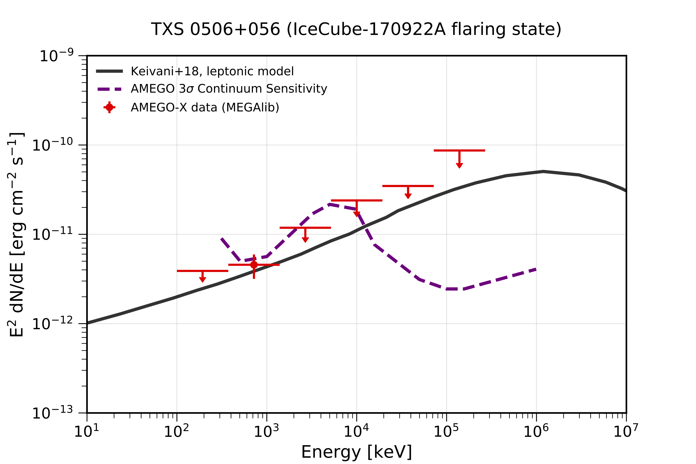

# MEGAPY

## Software <br />
One of the primary software tools used for designing future MeV Telescopes is MEGAlib, available [here](http://megalibtoolkit.com/home.html). MEGAlib simulates the emission from any gamma-ray source, simulates the instrument response, and generates the simulated data that would be detected for a given detector design, observation time, background emission, etc. See the above link for more details regarding the MEGAlib package. Examples for running MEGAlib can be found in the folders "Simulation_Challenge" and "GRB170817A".  

## Purpose <br />
The primary code in this folder is **MEGAlib_module.py**, which is called with **client_code.py**. The purpose of the module is to generate the inputs for MEGAlib, and process the simulated data. The main output is shown below for the specific case of TXS 0506+056. The black curve is the model spectrum that was simulated. The red data points are the observed (simulated) data. The error bars in the x-direction give the bin size, and the error bars in the y-direction give the 1-sigma statistical error. The module calculates the error, as well as the statistical significance of each bin. For reference, the dashed purple line shows the 3-sigma sensitivity of AMEGO.  

## Background <br />
The AMEGO backgrounds can be found [here](https://github.com/ComPair/Simulation-Data-Files/tree/master/AMEGO_Probe). There are two options, R1 and R5, each organzied with respect to the different components. Currently, I am using R5 as default. 

## Quick Start Guide: <br /> 


Below are quick start instructions:
```
1. Make the main working directory
  - Needs to contain the following
    -- client_code.py
    -- Run_MEGAlib_module.py (this can also just be in the the python path instead of the main directory)<br />
    -- Process_MEGAlib_module.py (this can also just be in the the python path instead of the main directory)<br />
    -- ExtractSpectrum.cxx
    -- ExtractLightCurve.cxx
    -- submit_jobs.py (for submitting to batch system)
    -- inputs.yaml
    -- AMEGO_Performance directory (for overlaying to plots; can be commented out in Process_MEGAlib_module.py if not wanted)

2. Specify inputs in inputs.yaml
  - The input files need to be in the main working directory, or a subdirectory therein.
  - Note: if input files are in a subdirectory then be sure to specify the relative path (from main directory).
  - The input files need to have the proper forms, as specified in the MEGAlib documentation. See TXS_0506_056 files for example template.

3. To run the code: python client_code.py
  - Uncomment the functions inside the client code that you want to run.
  - The yaml file can be passed from the terminal if needed, otherwise it uses the defualt specified in the client code.
  - The code can be ran directly from the terminal or submitted to a batch system using submit_jobs.py (for example).

4. The client code calls Run_MEGAlib_module.py and Process_MEGAlib_module.py
  - Run the help commands in the client code for a description of the function inputs for each module.
  - The module files shouldn't require too much modification.

Below are the executables for running directly from terminal (mainly for testing or saving configuration files):

1. cosima -s 432020 TXS_0506_056.source | tee terminal_output_cosima.txt
2. revan -g /zfs/astrohe/ckarwin/AMEGO_X/Geometry/AMEGO_Probe/AmegoBase.geo.setup -c revan_R1_clustering.cfg -f TXS_0506_056.inc1.id1.sim
3. mimrec -g /zfs/astrohe/ckarwin/AMEGO_X/Geometry/AMEGO_Probe/AmegoBase.geo.setup -f TXS_0506_056.inc1.id1.tra
```


