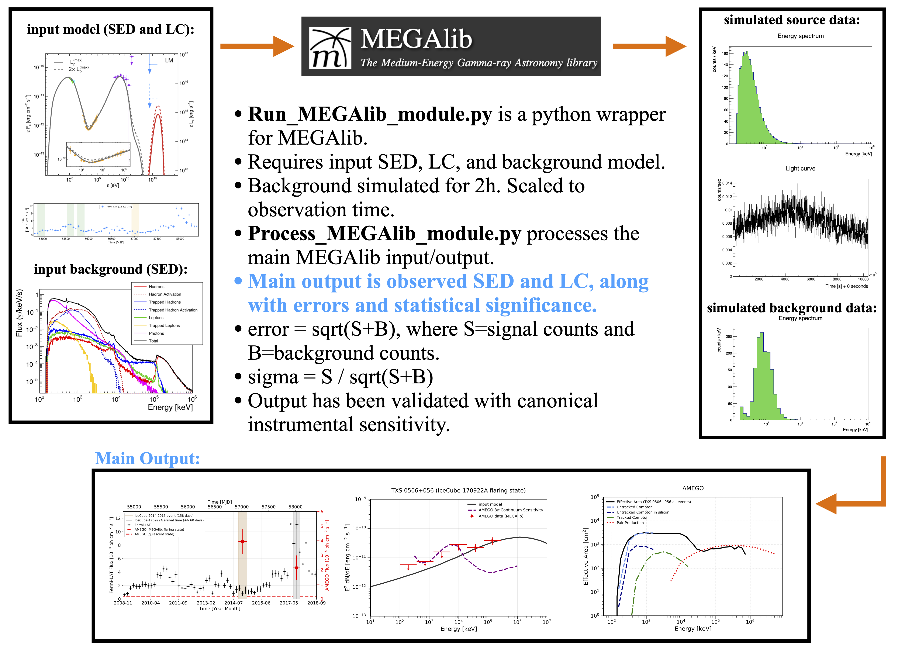
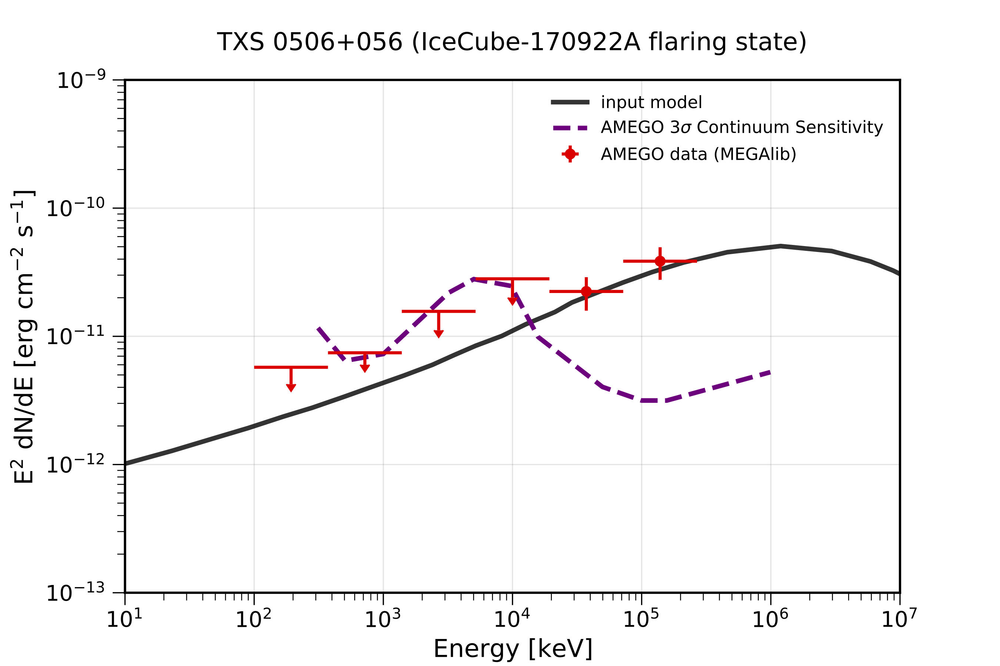
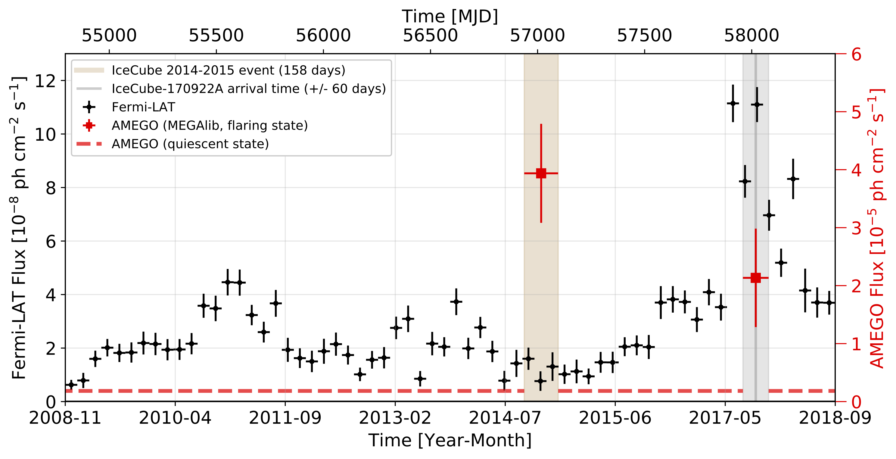

# MEGAlib Python Module

## Required Software  
The python module is meant to be used with the MEGAlib code, available [here](http://megalibtoolkit.com/home.html). Among other things, MEGAlib simulates the emission from any (MeV) gamma-ray source, simulates the instrument response, and generates the simulated data for a given detector design, exposure time, background emission, etc. See the above link for more details regarding the MEGAlib package. Examples for running MEGAlib can be found in this repository in the folders "Simulation_Challenge" and "GRB170817A".  

## Purpose  
The primary code in this folder is **Run_MEGAlib_module.py** and **Process_MEGAlib_module.py**, which is called with **client_code.py**. The Run_MEGAlib_module is essentially a python wrapper for running MEGAlib. The Process_MEGAlib_module processes the main MEGAlib input/output. The modules can be ran directly from the command line, or submitted to a batch system, which allows them to be easily employed for generating multiple simulations. Here, the code is applied to the specific case of TXS 0506+056 for AMEGO. 

## Getting Help and Additional Development  
For any help/problems with running the code please contact me at: ckarwin@clemson.edu. The main modules can easily be further developed for any MEGAlib tasks. I am happy to help with this if there are any specific requests!

## Background Models  
The code can be used for either AMEGO or AMEGO-X (here we are using AMEGO). The difference mainly amonts to the geometery file, the perfomance plots, and the backgrounds.

The AMEGO backgrounds can be found [here](https://github.com/ComPair/Simulation-Data-Files/tree/master/AMEGO_Probe). There are two options, R1 and R5, each organzied with respect to the different components. Currently, R5 is being employed as default. In general the background is calculated over the entire sky. For the main input file the total background can be extracted within ~20 degrees of the source. The background was simulated for 2 hours of exposure, so in the code it's scaled to the observation time that is specified in inputs.yaml. 

Note: the background tra file is very large and therefore not contained in this repository. 

## Basic Overview  
**Important Sanity Check: The code has been cross-checked with the canonical telescope performance, and it produces results that are consistent with the sensitivity.** 

Below is a schematic showing an overview of the general process:

## Quickstart Guide   
<pre>
 0. For fastest start (which will take care of step 1 below), directly clone from your working terminal as follows:
  - git clone --depth 1 --filter=blob:none --no-checkout https://github.com/ckarwin/AMEGO_X_Simulations.git
  - cd AMEGO_X_Simulations
  - git checkout master -- TXS_0506+056
  - Then just change the name of the directory as desired.
  
 1. Make the main working directory </b> 
  - Needs to contain the following
    -- client_code.py
    -- Run_MEGAlib_module.py (this can also just be in the the python path instead of the main directory)
    -- Process_MEGAlib_module.py (this can also just be in the the python path instead of the main directory)
    -- ExtractSpectrum.cxx
    -- ExtractLightCurve.cxx
    -- submit_jobs.py (for submitting to batch system)
    -- inputs.yaml
    -- AMEGO_Performance directory (needed for mission="AMEGO")
    -- AMEGO-X_Performance directory (needed for mission="AMEGO-X")

2. Specify inputs in inputs.yaml </b>
  - The input files need to be in a subdirectory of the main working directory called "Inputs".
  - The input files need to have the proper forms, as specified in the MEGAlib documentation. See TXS_0506_056 files in "Inputs" directory for example template.

3. To run the code: python client_code.py </b>
  - Uncomment the functions inside the client code that you want to run.
  - The yaml file can be passed with the terminal command if needed, otherwise it uses the defualt specified in the client code.
  - The code can be ran directly from the terminal or submitted to a batch system using submit_jobs.py (for example).

4. The client code calls Run_MEGAlib_module.py and Process_MEGAlib_module.py </b>
  - Run the help commands in the client code for a description of the function inputs for each module.
  - The module files shouldn't require too much modification.

Below are the original MEGAlib executables for running directly from terminal (mainly for testing, saving configuration files, etc):

1. cosima -s seed name.source | tee terminal_output_cosima.txt
2. revan -g geometry_file -c configuration_file -f name.inc1.id1.sim 
3. mimrec -g geometry_file -f name.inc1.id1.tra
</pre>

## Main Outputs  
The simulated SED and light curve are shown below in red. For the SED, upper limits are plotted for bins with signficance < 3-sigma. Note the general agreement with the canonical instrumental sensitivity (which has been scaled to the proper exposure time).

